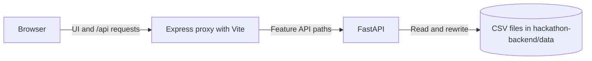

# Quality Matrix

Quality Matrix is a React application and FastAPI API for product information,
solution tracking, PYPCS quality submissions, action items, and chat. The API
uses files in `hackathon-backend/data` rather than a database; the browser
reaches it through the frontend's Express proxy.

## Repository Layout

```text
TheMatrix/
|-- docker-compose.yaml       # Container service and port configuration
|-- hackathon-backend/        # FastAPI application, configuration, and CSV data
|-- hackathon-frontend/       # React/Vite client and Express API proxy
`-- README.md                 # Project setup and architecture
```

The backend's `app/routers` defines API endpoints, and `app/services` contains
feature logic. The frontend separates its React code in `src/client` from its
Express proxy in `src/server`.

## Architecture



Express listens on port 5173 in local development. The frontend proxy target
uses `DJANGO_BASE_URL` as its environment-variable name, but the target service
is this FastAPI backend on port 8004.

The frontend instructions describe a Django target and say `forwardRequest`
adds `/api`; current code mounts `/api` in Express and appends the supplied
backend path directly to the configured base URL.

## Prerequisites

- Python 3.12+.
- Node.js LTS and npm. `package.json` does not specify a Node engine version.
- Windows PowerShell for the commands below.

## Run locally (Windows)

### First-time setup

```powershell
cd hackathon-backend
py -3.12 -m venv .venv
# If `py -3.12` is unavailable, use: python -m venv .venv
.\.venv\Scripts\python.exe -m pip install -r requirements.txt
```

Install frontend dependencies and create `hackathon-frontend/.env.development`
with the variable names `PORT`, `NODE_ENV`, `DJANGO_BASE_URL`, and
`VITE_ENCRYPTION_KEY`. Set `DJANGO_BASE_URL` to the backend URL, normally
`http://127.0.0.1:8004`. Keep any encryption key value private.

```powershell
cd ..\hackathon-frontend
npm install
```

### Every time

Start the backend in the first PowerShell terminal. The local data override
keeps UI edits in `hackathon-backend/data`; without it, the backend uses the
team network share configured in `.env.production`.

```powershell
cd hackathon-backend
$env:QUALITY_MATRIX_DATA_DIR = "data"
.\.venv\Scripts\python.exe -m uvicorn main:app --reload --port 8004
```

Start the frontend in a second terminal:

```powershell
cd hackathon-frontend
npm run dev
```

### Verify

- Backend health: <http://127.0.0.1:8004/health>
- API docs: <http://127.0.0.1:8004/docs>
- UI: <http://localhost:5173>

If PowerShell's `Invoke-WebRequest` reports a proxy error for localhost, test
with `curl.exe --noproxy "*" http://127.0.0.1:8004/health`.

### Docker Compose

Compose declares frontend port 8005 and backend port 8004. It is not buildable
from this checkout as-is: the frontend Dockerfile referenced by Compose is
absent, and the backend Dockerfile copies an `intel-ca.crt` that is absent.
The backend data mount is also configured as `/mnt/x/Quality:/app/data`, which
is environment-specific and needs a suitable host path on Windows.

## Configuration

| Variable | File or source | Purpose |
| --- | --- | --- |
| `PORT` | Frontend `.env.development` | Express listen port; local setting is 5173. |
| `DJANGO_BASE_URL` | Frontend `.env.development` | FastAPI base URL; local setting is `http://127.0.0.1:8004`. The name is legacy. |
| `NODE_ENV` | Frontend `.env.development` / npm script | Selects development or production mode and env file. |
| `VITE_ENCRYPTION_KEY` | Frontend `.env.development` | Loaded into server config; keep any value private. |
| `VITE_API_BASE_URL` | Frontend `.env.development` | Present in the env file; no consumer was found in current source. |
| `QUALITY_MATRIX_DATA_DIR` | Backend `.env.production` or shell | `.env.production` sets the team network share location. Defaults to `data`; for local data, set `$env:QUALITY_MATRIX_DATA_DIR = "data"` in the backend PowerShell window before starting Uvicorn. |
| `ALLOWED_ORIGINS` | Backend environment | Comma-separated browser origins; defaults include ports 5173 and 3000. |
| `NYRA_API_KEY` | Backend `.env.production` | Required by the chat endpoint; secret. |
| `NYRA_CHAT_MODEL` | Backend `.env.production` | Optional chat model override; code default is `gpt-5.4-mini`. |
| `HTTP_PROXY`, `HTTPS_PROXY`, `FTP_PROXY`, `NO_PROXY` | Root `.env.production` | Optional proxy settings passed to the Compose builds and containers. |

The frontend env file also contains `VITE_ENCRYPTION_KEY`; do not put its value
in documentation or commit sensitive values. Compose reads the root
`.env.production`, which is separate from the backend's `.env.production`.

## Troubleshooting

| Symptom | Cause | Fix |
| --- | --- | --- |
| `Activate.ps1` is blocked | PowerShell execution policy prevents script activation. | From `hackathon-backend`, use `.\.venv\Scripts\python.exe` directly as shown above. Or run `Set-ExecutionPolicy -Scope Process -ExecutionPolicy Bypass` in that window only, then activate. |
| `python` or `uvicorn` is not found | The venv is missing, or a bare command is being used. | From `hackathon-backend`, run `.\.venv\Scripts\python.exe -m uvicorn main:app --reload --port 8004`. |
| `ModuleNotFoundError` | Backend requirements or frontend packages are missing. | Backend, from `hackathon-backend`: `.\.venv\Scripts\python.exe -m pip install -r requirements.txt`. Frontend: run `npm install` in `hackathon-frontend`. |
| Port 8004 or 5173 is already in use | Another process owns the port. | Check with `Get-NetTCPConnection -LocalPort 8004` (or `5173`), inspect it with `Get-Process -Id <OwningProcess>`, then stop that process if appropriate. Alternatively, choose another backend port and update `DJANGO_BASE_URL`. |
| Frontend starts, but API calls fail, return 502, or show `ECONNREFUSED` | Backend is not running, or `DJANGO_BASE_URL` is wrong. | Start the backend and set `DJANGO_BASE_URL` in `.env.development` to its URL, such as `http://127.0.0.1:8004`. |
| Pages are empty or View 2 shows 0 items | Backend is reading the team share, which may not contain local action-item data. | Set `$env:QUALITY_MATRIX_DATA_DIR = "data"` in the backend terminal before starting Uvicorn. |
| Share reads fail or startup is slow | The team network share is unavailable, for example when off VPN or without access. | Connect to the team network/VPN, or use local data mode above. |
| `Invoke-WebRequest` gets 403 for localhost | PowerShell request is going through the configured corporate proxy. | Use `curl.exe --noproxy "*" http://127.0.0.1:8004/health`, or set `$env:NO_PROXY = "localhost,127.0.0.1"` for the session. |
| `pip install` or `npm install` fails behind the proxy | The package client cannot reach its registry through the corporate proxy. | Configure the approved corporate proxy for pip/npm, then retry the install. |
| Frontend starts on the wrong port or proxy requests fail | `.env.development` is missing or misconfigured; the server may still start. | Create `hackathon-frontend/.env.development` and define `PORT`, `NODE_ENV`, `DJANGO_BASE_URL`, and `VITE_ENCRYPTION_KEY`. |
| A command copied from frontend `AGENTS.md` fails | Its Routing section contains a malformed pasted command. | Do not copy commands from that section; use the commands in this README. |

The stale Browserslist data warning at frontend startup is harmless.

## Pages and Data

| Page | Browser route | Backend API | Data files |
| --- | --- | --- | --- |
| TI (STHI / LCBI) | `/ti/sthi`, `/ti/lcbi` | `/product-basis/{module}` | `ProductBasisInfo_STHI.csv`, `ProductBasicInfo_LCBI.csv` |
| PdO (STHI / LCBI) | `/pdo/sthi`, `/pdo/lcbi` | `/product-basis/{module}`; matrix/catalog APIs: `/pdsolutions/{module}`, `/solutions` | Product-basis files above; `ProductSolutionMatrix_STHI.csv`, `ProductSolutionMatrix_LCBI.csv`, `Solution.csv` |
| GL-MQR (STHI / LCBI) | `/gl-mqr/sthi`, `/gl-mqr/lcbi` | Proxy requests `/solutions/sthi` and `/solutions/lcbi`; FastAPI currently exposes `/solutions` with a `module` query parameter | `Solution.csv` |
| Quality Matrix (PYPCS) | `/pypcs` | `/pypcs/modules`, `/pypcs/questions`, `/pypcs/submissions`, `/pypcs/matrix-submission`, and related `/pypcs/*` endpoints | `PYPCS_Modules.csv`, `PYPCS_Questions.csv`, `PYPCS_QuestionModuleMap.csv`, `PYPCS_Submissions.csv`, `PYPCS_SubmissionAnswers.csv`, `PYPCS_SubmissionCells.csv`, `Operation_Process_Step.csv` |
| View 2 | `/view-2` | `/pypcs/action-items` and `/pypcs/action-items/options` | `PYPCS_ActionItems.csv` |
| Chat | `/chat` | `/chat` (health: `/chat/health`) | No local data file; requires NYRA configuration and `nyra-services` (not in `requirements.txt`) |

The GL-MQR proxy path and FastAPI route do not currently match; see the API
routers before relying on that page. View 2 supports adding and editing action
items; it does not currently provide delete behavior.

## Data Notes

CSV files under `hackathon-backend/data` are the source of truth for the
features above. Updates rewrite the corresponding CSV file, so back up the data
before bulk edits. The API has no authentication by design; run it only in an
appropriate trusted environment.

## Planned Work

View 3 is planned to join Quality Matrix submissions with View 2 action items
using applicability question IDs. It is not implemented.

## Further Documentation

- [Backend instructions](hackathon-backend/AGENTS.md)
- [Frontend instructions](hackathon-frontend/AGENTS.md)
- [Frontend README](hackathon-frontend/README.md)